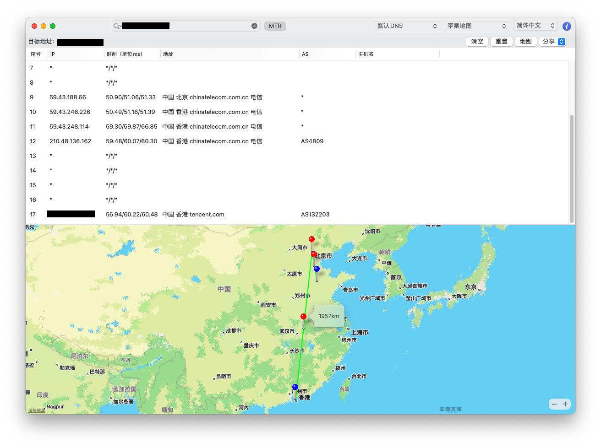

## 香港轻应用服务器网络  腾讯云 VS 阿里云 (济南电信)

***

作者：付浩

日期：2021年8月24日

### 腾讯云

> Ping

```shell
fuhao@iMac-fuhao ~ % ping 43.132.*.*
PING 43.132.*.* (43.132.*.*): 56 data bytes
64 bytes from 43.132.*.*: icmp_seq=0 ttl=47 time=54.971 ms
64 bytes from 43.132.*.*: icmp_seq=1 ttl=47 time=54.933 ms
64 bytes from 43.132.*.*: icmp_seq=2 ttl=47 time=54.825 ms
64 bytes from 43.132.*.*: icmp_seq=3 ttl=47 time=54.770 ms
^C
--- 43.132.*.* ping statistics ---
4 packets transmitted, 4 packets received, 0.0% packet loss
round-trip min/avg/max/stddev = 54.770/54.875/54.971/0.081 ms
```

> 使用 BestTrace 跃点跟踪



### 阿里云

> Ping

```shell
fuhao@iMac-fuhao ~ % ping 8.210.*.*
PING 8.210.*.* (8.210.*.*): 56 data bytes
Request timeout for icmp_seq 0
64 bytes from 8.210.*.*: icmp_seq=1 ttl=43 time=103.755 ms
Request timeout for icmp_seq 2
Request timeout for icmp_seq 3
Request timeout for icmp_seq 4
^C
--- 8.210.*.* ping statistics ---
6 packets transmitted, 1 packets received, 83.3% packet loss
round-trip min/avg/max/stddev = 103.755/103.755/103.755/0.000 ms
```

> 使用 BestTrace 跃点跟踪


### 文档信息

***

- 版权声明：自由转载-非商用-非衍生-保持署名（[创意共享3.0许可证](https://creativecommons.org/licenses/by-nc-nd/3.0/deed.zh)）
- 发表日期： 2021年8月24日